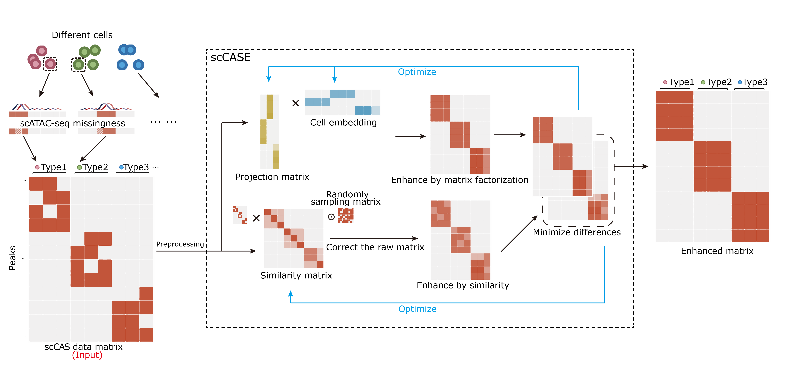

# Accurate and interpretable enhancement for single-cell chromatin accessibility sequencing data with scCASE

## Installation
scCASE is available on [PyPI](https://pypi.org/project/sccase/) and can be installed via
	
	pip install scCASE

You can also install scCASE from GitHub via
	
	git clone git://github.com/BioX-NKU/scCASE.git
	cd scCASE
	python setup.py install
	
The dependencies will be automatically installed along with scCASE. Normally, the installation time does not exceed one minute.   

## Quick Start
### We provide a [tutorial](https://github.com/BioX-NKU/scCASE/blob/main/Tutorial.ipynb) for running scCASE (tested on Ubuntu 22.04 LTS). The expected run time for the tutorial is less than 5 minutes.
### The source codes for the reproduction of results, all dependencies including version numbers, and the dataset for tutorial are publicly available at [Zenodo](https://zenodo.org/record/8382877).

#### Input
* **h5ad file**:
	* AnnData object of shape `n_obs` × `n_vars`. 
* **count matrix file**:  
	* Rows correspond to peaks and columns to cells, in **txt**/**tsv** (sep=**"\t"**) or **csv** (sep=**","**) format.

#### Output
* **Enhanced scCAS data**:  The data enhanced by scCASE.
* **Optional output:**
	* **Projection matrix(W)**:  Projection matrix created by scCASE, which is the peak expression program.
	* **Cell embedding matrix(H)**:  Cell embedding created by scCASE, which is the low-dimensional representation of cells.
	* **Similarity matrix(Z)**: Similarity matrix created by scCASE, which is the cell-to-cell similarity calculated through iteration.

#### Run
* **Use functions in SCALE packages:**
	import scCASE
	result = scCASE.run(data_path)

**Optional parameters**
Here we introduce the parameters of the scCASE method.
	scCASE.run(data_path,ref_path = None,method = "scCASE",data_format = "count matrix",       data_sep=",",ref_sep=",",type_number_range=range(3, 15),output_path = "./",save_other_matrixs_ = False,obs_key = None,var_key = None,threshold = 0.01,saveZ = False,changeK = "+0",changeK_ref = "+0",save_result = False)

* `data_path`:str 
The path and file name of the target scCAS data.
* `ref_path`:str
The path and file name of the reference data.
* `method`:str
Enhancement methods including **scCASE** and **scCASER**.
* `data_format`:str `Default: "count matrix"`
The format of data and reference data, including **count matrix**(csv/txt/tsv) and **h5ad**. 
* `data_sep`:str `Default: ","`
The Separator of target scCAS data, only for count matrix file.
* `ref_sep` :str `Default: ","`
The Separator of reference data, only for count matrix file.
* `type_number_range`:range `Default: range(3, 15)`
The range of possible number of cell types.
* `output_path`:str `Default: "./"`
The path of the output.
* `save_other_matrixs_`:bool `Deafult: False`
If save the matrices of Z, W and H or not.
* `obs_key`:str `Default: None`
The key of cell name in adata.obs.
* `var_key`:str `Default: None`
The key of peak name in adata.var.
* `threshold`:float `Default: 0.01`
The threshold of filtering peaks.
* `saveZ`:bool `Default: False`
If save the initialized value of matrix Z. If you need to use scCASe multiple times for the same data, with different parameters, please select True, which can significantly accelerate the speed.
* `save_result`: bool `Default: Flase`
If save the enhanced result or not.